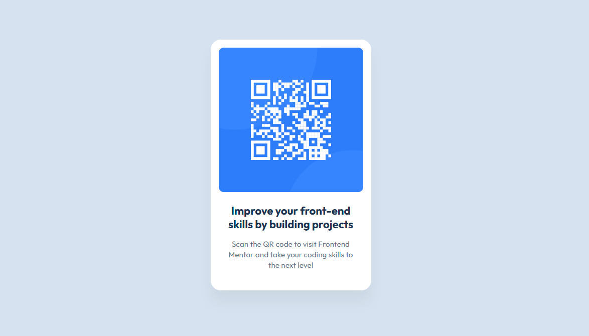

# Frontend Mentor - QR Code Component Solution

This is my implementation of the [QR Code Component challenge](https://www.frontendmentor.io/challenges/qr-code-component-iux_sIO_H) from Frontend Mentor.

## Table of Contents

- [Frontend Mentor - QR Code Component Solution](#frontend-mentor---qr-code-component-solution)
  - [Table of Contents](#table-of-contents)
  - [Overview](#overview)
    - [Screenshot](#screenshot)
    - [Links](#links)
  - [My Process](#my-process)
    - [Built With](#built-with)
    - [**Why I Used CSS Custom Properties**](#why-i-used-css-custom-properties)
  - [What I Learned](#what-i-learned)
  - [Continued Development](#continued-development)
  - [Useful Resources](#useful-resources)
  - [Author](#author)

## Overview

### Screenshot



### Links

-   Solution URL: [GitHub Repository](https://github.com/Paul-DK/webdev-challenges/tree/main/fem-challenges/qr-code-component)
-   Live Site URL: [GitHub Pages](https://paul-dk.github.io/webdev-challenges/fem-challenges/qr-code-component/)

## My Process

### Built With

-   Semantic HTML5 markup
-   CSS custom properties
-   Flexbox for layout
-   Responsive design principles

### **Why I Used CSS Custom Properties**

One of the biggest takeaways from this project was **learning how to use CSS custom properties** (variables) effectively. My approach was inspired by **Kevin Powell**, whose enthusiasm for CSS variables made me really appreciate their power.

**Benefits of using custom properties in this project:**

-   **Easier Maintenance:** Instead of hardcoding colors, font sizes, and spacing throughout the CSS file, I defined them once and reused them everywhere.
-   **Scalability:** If I need to tweak a design element later, I only have to update the variable instead of searching through multiple styles.
-   **Consistency:** Variables ensure the design remains cohesive across different sections.
-   **Future-Proofing:** As I tackle more complex projects, I want to keep my CSS modular and adaptable.

**Example of my CSS variables:**

```css
:root {
    --clr-neutral-100: hsl(0, 0%, 100%);
    --clr-slate-900: hsl(218, 44%, 22%);
    --clr-slate-500: hsl(216, 15%, 48%);
    --clr-slate-300: hsl(212, 45%, 89%);
    --font-700-lg: 700 1.375rem/120% Outfit, Helvetica, Arial, sans-serif;
    --font-400-md: 400 0.9375rem/140% Outfit, Helvetica, Arial, sans-serif;

    --max-width-card: 320px;
    --max-width-qr: 288px;

    --ltr-space-heading: 0rem; /* 0px */
    --ltr-space-body: 0.0125rem; /* 0.2px */

    --space-lg: 2.5rem; /* 40px */
    --space-md: 1.5rem; /* 24px */
    --space-sm: 1rem; /* 16px */

    --radius-card: 1.25rem; /* 20px */
    --radius-qr: 0.625rem; /* 10px */
}
```

This project solidified my understanding of when and why to use custom properties, and I plan to use them in all my future Frontend Mentor challenges.

## What I Learned

Through this project, I reinforced my understanding of:

-   **Structuring semantic HTML** to improve accessibility.
-   **Utilizing CSS variables** for consistent theming.
-   **Implementing responsive designs** using flexbox.

## Continued Development

In future projects, I aim to:

-   **Enhance accessibility** by ensuring all interactive elements are keyboard-navigable.
-   **Explore advanced CSS layouts with Grid**.
-   **Implement ARIA roles** to further support assistive technologies.

## Useful Resources

-   [Kevin Powell - Why CSS Variables Are Amazing](https://www.youtube.com/watch?v=sdyRRxOn1_w) - A fantastic video explaining the power of CSS custom properties.
-   [WebAIM Contrast Checker](https://webaim.org/resources/contrastchecker/) - Tool for verifying color contrast ratios.
-   [MDN Web Docs: alt Attribute](https://developer.mozilla.org/en-US/docs/Web/HTML/Element/img#attr-alt) - Guidance on providing effective alternative text for images.

## Author

GitHub - [Paul-DK](https://github.com/Paul-DK)  
Frontend Mentor - [@Paul-DK](https://www.frontendmentor.io/profile/Paul-DK)  
BlueSky - [@pauldk.bsky.social](https://pauldk.bsky.social)
